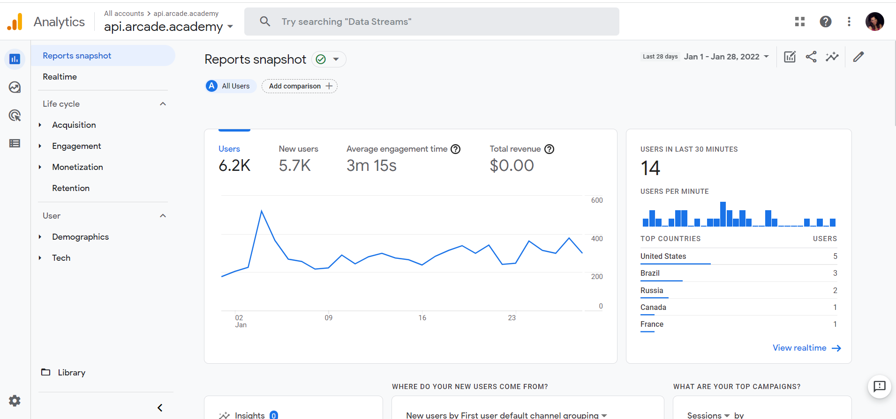
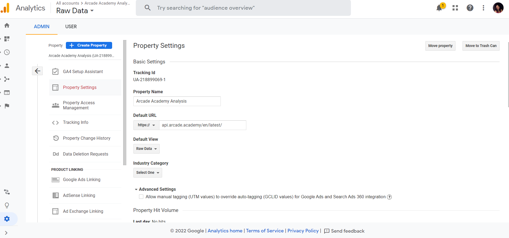
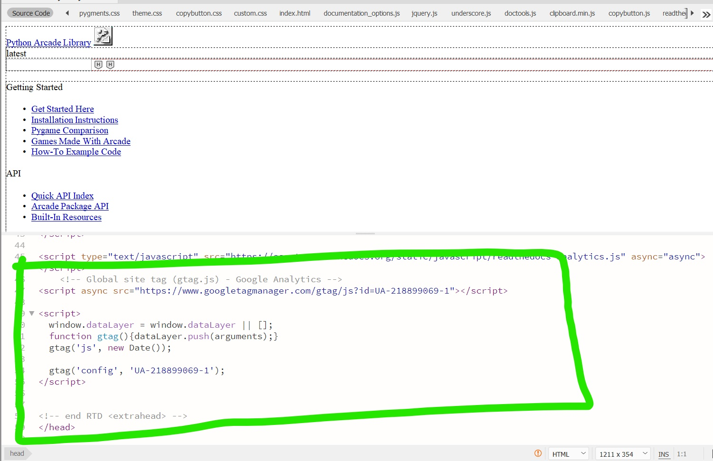
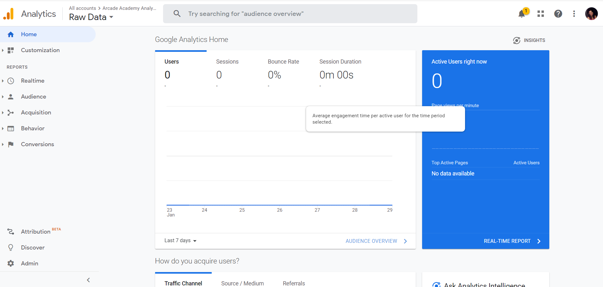
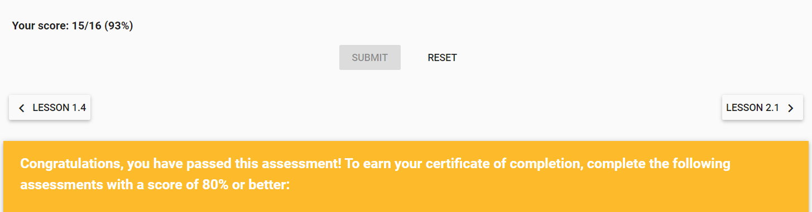

Week 3 Report
==============

Google Analytics Basics & Set Up (2 hours)
------------------------------------------
During week 3 (Week One of Google Analytics), basic terminology and tools necessary for proper Google Analytics setup
and execution were covered.

Additionally, user behavior on a website was covered with the following key stages to note:

* **Purchase Funnel Stages**

  * **Acquisition**: Building awareness and gaining user interest.

  * **Behavior**: Users engaging with a business

  * **Conversion**: Users become customers and transact.

Understanding the predicted behavior of users on the web supports the mission of purpose of Google Analytics.
Utilizing this tool allows businesses to appreciate and adapt to their target audiences patterns and needs.

Account Setup
-------------
Logged into Google Analytics and input the website information to add properties, views and filters.

**Dashboard:**

Added Property:
---------------

Added Multiple Views:
---------------------

.. image:: views.jpg
   :width: 50%

Added Global Tag to HTML
-------------------------

**Dashboard Result: Need Review/Assistance**

Note:This was my attempt to add the global tag to the HTML which appears to be unsuccessful. There were
zero views despite my activity on the site, and I did not have my I.P Address to be excluded in the data in
this particular view/filter.

*Website Used:* `Arcade Academy <https://api.arcade.academy/en/latest/>`_

Exercises & Assessments (2 Hours)
--------------------------------------------
**Assessment 01: Pass**

Course Material included an interactive demo for adding views that was complete. This covered how to
add, copy, and remove filters for different properties.

Reading, Videos, & Additional Research (4 Hours)
-------------------------------------------------
1. Google Analytics Course Content (`Google Analytics Course <https://analytics.google.com/analytics/academy/course/6/unit/1/lesson/1>`_)
2. YouTube (`Measure School <https://measureschool.com/google-tag-manager-vs-global-site-tag/>`_)
3. Blog (`Hootsuite <https://blog.hootsuite.com/how-to-set-up-google-analytics/>`_)
4. Article (`Chartio <https://chartio.com/learn/marketing-analytics/how-to-add-google-analytics-tracking-to-a-website/>`_)

Documentation, Organization and Final Review of Content (1 hour)
----------------------------------------------------------------
The main goal of the content this week after account setup, was adding a global tag to the HTML of a website and test
to ensure everything was working properly. Overall, I understand the content and purpose of Google Analytics, including
how to properly edit filters to get a desired type of data. Despite multiple attempts to learn what I was doing wrong, I
was not able to get the data to transfer over. During our meeting this week I would like to review this to get a thorough
understanding of properly adding and setting up these accounts.

TOTAL APPROXIMATE WEEKLY TIME COMMITMENT: **9-10 Hours**
=========================================================

