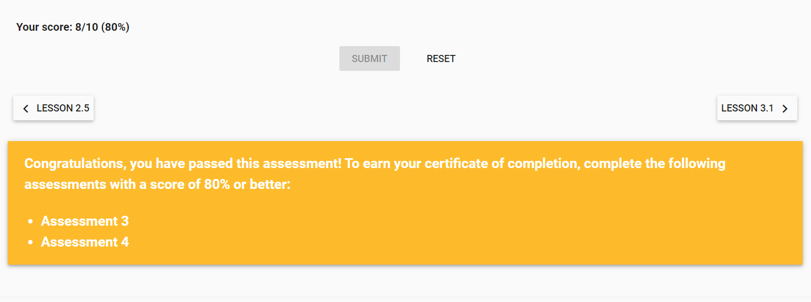

Week 4 Report
==============

Google Analytics Interface (Videos, Course Content and Course Reading) (2 hours)
-----------------------------------------------------------------------
Completion of Lesson 2.1-2.5

3 Interactive Demo Exercises (2 Hours)
------------------------------------------
**Interactive Demo 1: Interface Tour**

**Interactive Demo 2: Audience Overview**

**Interactive Demo 3: Save, Share or Export Reports**

Exercises,Assessments, and Weekly Meeting (2 Hours)
--------------------------------------------------
**Assessment 02: Pass**

**Notes Lesson 02**

Reading, Videos, & Additional Research (2 Hours)
-------------------------------------------------
1. Google Analytics Course Content (`Google Analytics Course <https://analytics.google.com/analytics/academy/course/6/unit/2/lesson/1>`_)
2. Solutions Gallery (`Solutions Gallery <https://analytics.google.com/analytics/gallery/?hl=en_US#posts/search/%3F_.type%3DDASHBOARD%26_.start%3D0//>`_)
3. Blog (`Kinsta <https://kinsta.com/blog/how-to-use-google-analytics/>`_)

Documentation, Organization and Final Review of Content (1 hour)
----------------------------------------------------------------
Lesson 02 of Google Analytics walked through several videos and interactive demo environments pertaining to analytics
navigation. This week covered numerous types of reports, metrics, selectors and how to operate the dashboard. Setting up
and utilizing the tools covered this week will be covered in Lesson 3.0, including metrics, dimensions, goals, and other filters.

Understanding different ways of interacting with data through Google Analytics will represent accurate and clean information
about user behavior. Reports can be shared or viewed in specific views to obtain a particular set of data. To target and answer
questions about interaction with a website, it's important to understand what filters and report views to select for accuracy and efficiency.

TOTAL APPROXIMATE WEEKLY TIME COMMITMENT: **8-9 Hours**
---------------------------------------------------------
