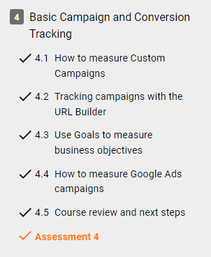
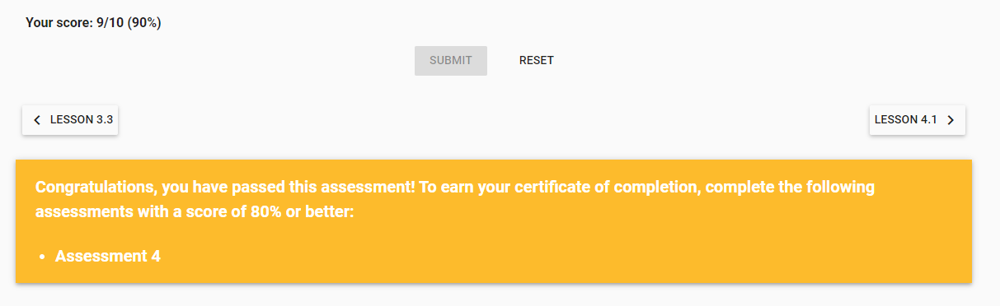

Week 5 Report
==============

Google Analytics Basic Reports (Videos, Course Content and Course Reading) (3 hours)
-----------------------------------------------------------------------
**Completion of Lesson(s) 3.1-3.3 & 4.1-4.5**

Notes,Assessments, and Weekly Meeting (3 hours)
--------------------------------------------------
**Assessments**

**Notes**

.. image:: datathresholdanalytics.png
   :width: 50%

Google Ads Sign Up
------------------

Signed up and started a Google Ads Campaign (not completed as it costs to finish the campaign).

Reading, Videos, & Additional Research (2 Hours)
-------------------------------------------------

1. Google Analytics Course Content (`Lesson 3 <https://analytics.google.com/analytics/academy/course/6/unit/3/lesson/1>`_)

2. Google Analytics Course Content (`Lesson 4 <https://analytics.google.com/analytics/academy/course/6/unit/4/lesson/1>`_)

2. Reading/Viewing (`Campaign Data <https://www.bounteous.com/>`_)

3. Reading (`Best Practices <https://support.google.com/analytics/answer/1037445?hl=en>`_)

Documentation, Organization and Final Review of Content (1 hour)
----------------------------------------------------------------
Lesson 3 and 4 was covered this week, which included a deeper look into audience, behavior and acquisition reports. Additionally, the importance of marketing and
Google Ads was introduced with some time spent reviewing the ads process. There are numerous ways to advertise a site and many factors to consider when setting the
appropriate filters, goals and other elements of data organization.

Understanding how users interact with a site is vital to the long term success and user experience. Using Google Analytics and visualizing the extensive but unique
experiences each user has, creates an enormous amount of information to be used to grow a site. Whether it's a high level overview or drilling into the very specific
details, if set up properly, analytics is crucial to the success of a website and/or company.

TOTAL APPROXIMATE WEEKLY TIME COMMITMENT: 9-10 Hours
-----------------------------------------------------
