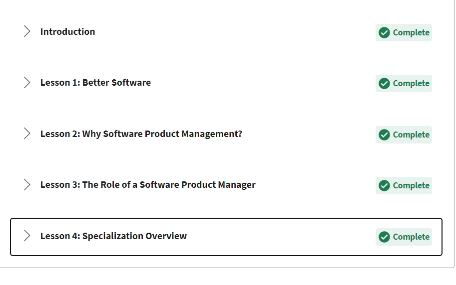

Week 6 Report
==============

Software Product Management Overview (Course Content and Required Course Reading) (2 hours)
-----------------------------------------------------------------------
Week 1-2. Capstone preparation and Intro Product Management content (pre-requisites for Simulated Project)
All lessons complete for Week One & Two, including several interactive mini-quizzes outside of graded exams.

Review of Module Requirements, Roadmaps and Certification Process (1 Hour)
--------------------------------------------------------------------------

Discussions, Assessments, and Weekly Meeting (2 Hours)
--------------------------------------------------
**Quiz 1- PASS**

**Quiz 2- PASS**

**Focused heavily on the 12 Agile Principles that will be applied during Project Simulation**

Reading, Videos, & Additional Research (2 Hours)
-------------------------------------------------
1. All Course Content (`Coursera Software Product Management <https://www.coursera.org/learn/introduction-to-software-product-management/home/week/1>`_)
2. Reading (`What Exactly is a Product Manager? <https://www.mindtheproduct.com/2011/10/what-exactly-is-a-product-manager/>`_)
3. Video (`Ted Talk <https://www.ted.com/talks/tony_fadell_the_first_secret_of_design_is_noticing>`_)
4. Video (`Ted Talk on Collective Creativity <https://www.ted.com/talks/linda_hill_how_to_manage_for_collective_creativity>`_)
5. Reading (`Project Success <http://www.ambysoft.com/surveys/success2013.html>`_)
6. Reading (`Validation vs Verification <https://www.softwaretestinghelp.com/what-is-verification-and-validation/>`_)
7. Reading (`Agile Manifesto <http://www.agilemanifesto.org/>`_)

Documentation, Organization and Final Review of Content (1 hour)
----------------------------------------------------------------
This week into next, I will continue working on the pre-requisite modules 1-5 in the Coursera content for Software Product Management Specialization.
In module 1 & 2, the basic terminology, requirements and core content was covered along with extensive reading material and videos. This course
references the Agile Manifesto heavily and encourages the use and structure of Agile methodologies. Each module covered up until Module 6, are building
blocks for the simulated 6 week project that will begin in Report 8, and end in Report 13 of this (CIS-385) Capstone Course.

Important takeaways from this weeks content included the value of client collaboration, practicing exceptional leadership with the development team,
and being open and accepting of constant change. Product Software Management requires an individual who can speak to the client and relay their needs to the
development and design team. They are not to be a messenger between the two, but rather a thorough translator that can communicate effectively with
both parties.

Agile Methodologies have been consistently used across teams for precise and timely product management practices. Several factors that often quickly
become stressful to a team can be reduced by implementing such practices, leaving both the client and the team feeling accomplished.

Schedule Preparation for next week (REPORT 7) (30 mins)
-------------------------------------------------------
*Tuesday & Wednesday: Module 3*
*Thursday & Friday: Module 4*
*Saturday & Sunday: Module 5*

Simulation Project will begin in Report 8 and end in Report 13 (Module 6). The weekly map is displayed below.

TOTAL APPROXIMATE WEEKLY TIME COMMITMENT THIS WEEK: **8-9 Hours**
---------------------------------------------------------