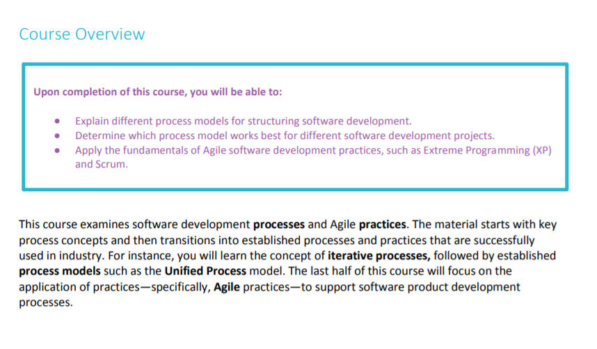
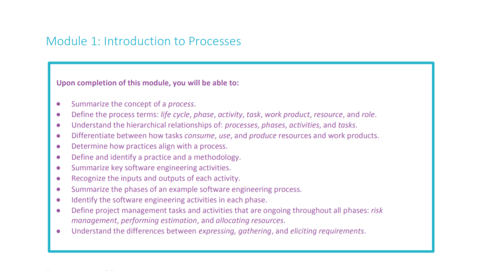
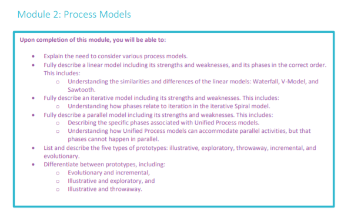
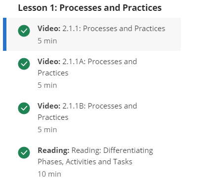
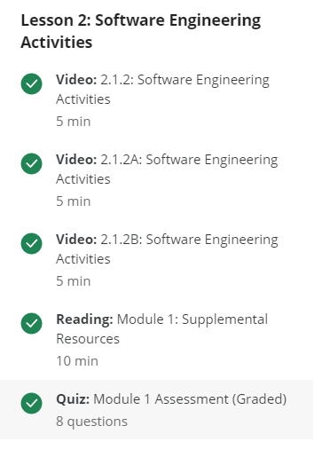
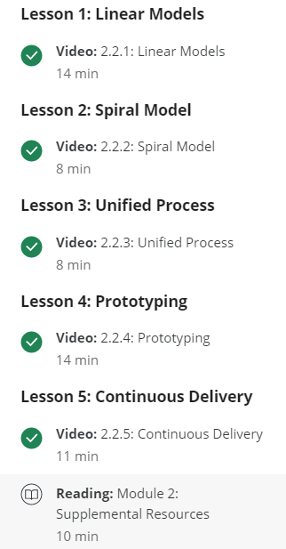
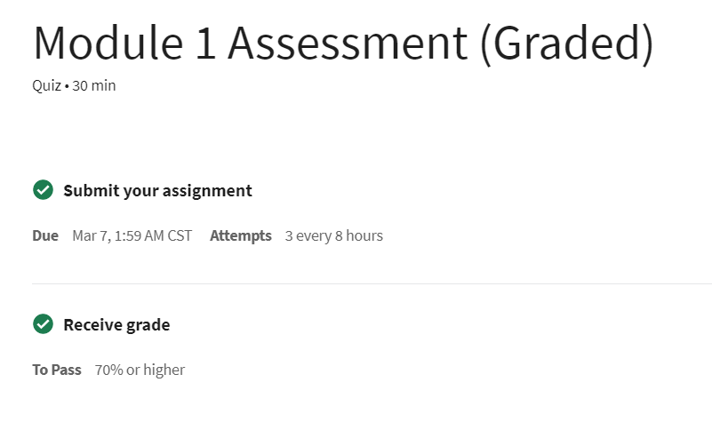
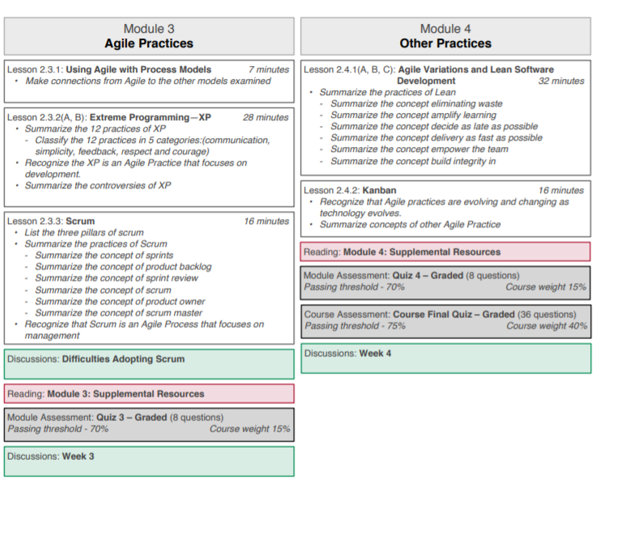

Week 7 Report
==============

Software Product Management Overview (Course Content, Mini Quizzes and Required Course Reading) (3 hours)
-----------------------------------------------------------------------
Module 1 and Module 2 of Software and Agile Processes (3 & 4 Overall)

*Below are course objectives and modules complete for Report 7*

Discussions, Assessments, and Weekly Meeting (2 Hours)
------------------------------------------------------
*This weeks exam (outside of quizzes and mini quizzes)*

30 minutes for weekly meeting, and an additional hour reading/writing to discussion board.

Reading, Videos, & Additional Research (2 Hours)
-------------------------------------------------
1. All Course Content (`Coursera Software Product Management <https://www.coursera.org/learn/introduction-to-software-product-management/home/week/1>`_)
2. Reading (`Software Development Process <https://en.wikipedia.org/wiki/Software_development_process>`_)
3. Reading (`A Rational Design Process <https://www.ics.uci.edu/~taylor/classes/121/IEEE86_Parnas_Clement.pdf>`_)
4. Reading (`Egoless Programming <https://blog.codinghorror.com/the-ten-commandments-of-egoless-programming/>`_)
5. Reading (`Short History of Software Methods <https://ww.davidfrico.com/rico04e.pdf/>`_)
6. Reading (`Waterfall Method <https://pragtob.wordpress.com/2012/03/02/why-waterfall-was-a-big-misunderstanding-from-the-beginning-reading-the-original-paper/>`_)
7. Video (`Build a Tower, Build a Team <https://www.youtube.com/watch?v=H0_yKBitO8M/>`_)

Documentation, Organization and Final Review of Content (1 hour)
----------------------------------------------------------------
This week covered Software and Agile Processes and Practices. Lesson 1 & 2 in Module 1 covered Processes
and Practices and Software Engineering Activities. Differentiating Phases, Activities and Tasks was covered in detail,
along with the importance of understanding when to use them. Lesson 2 covered Software Engineering Activities
which included differentiating roles and work products along with risk management and estimations. While a lot of the
terminology and descriptions sound similar, it is vital to properly differentiate when working product management
with a team. These practices and processes are put into place to create a consistent and well executed plan and product release.

Updated Time Line/Plan for Week and Remainder of Term (30 mins)
------------------------------------------------------
**Week 08** Module 4, 5 and 6

**Week 09 - Week 14** Module 7-13

Total Approximate Weekly Time Commitment: 8-9 Hours
----------------------------------------------------
