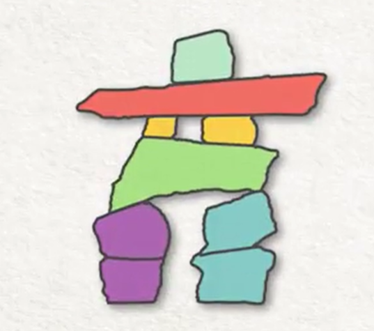
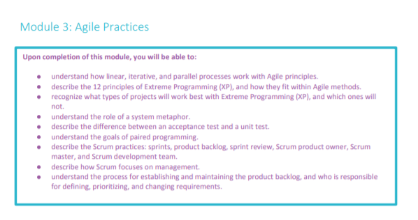
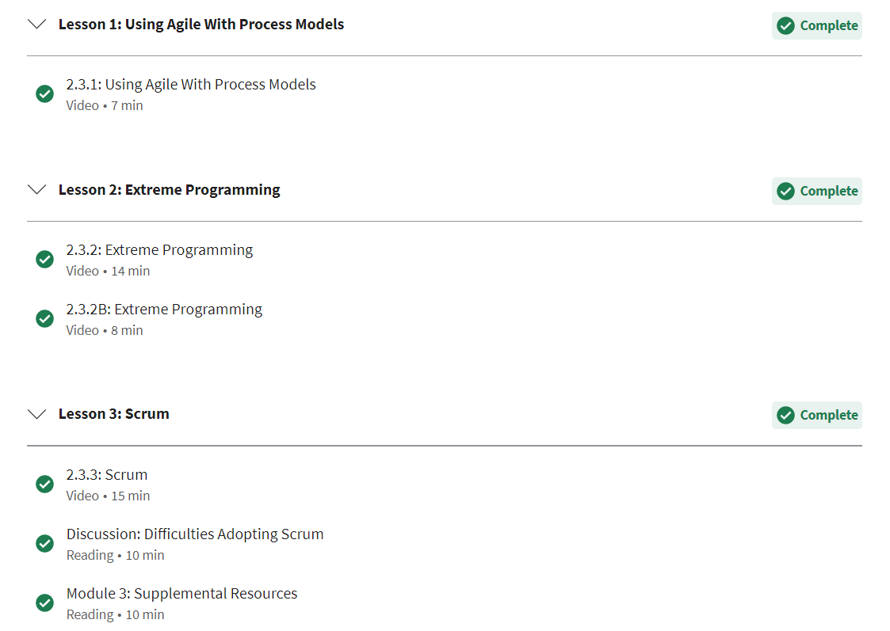
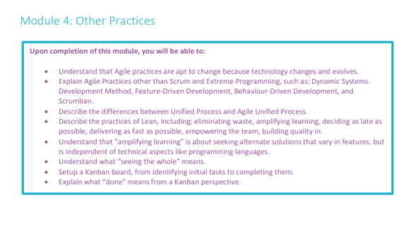
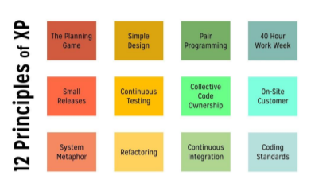
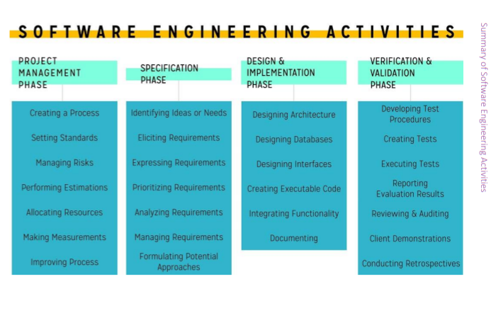
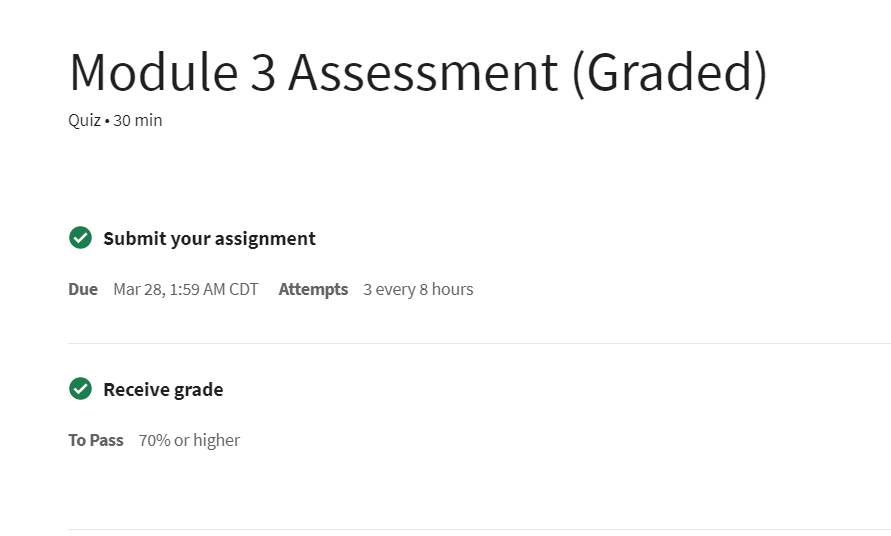
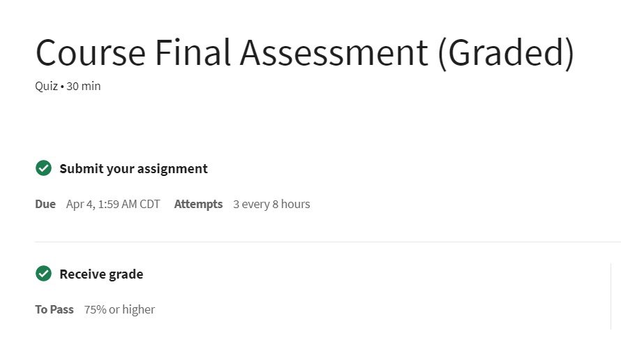
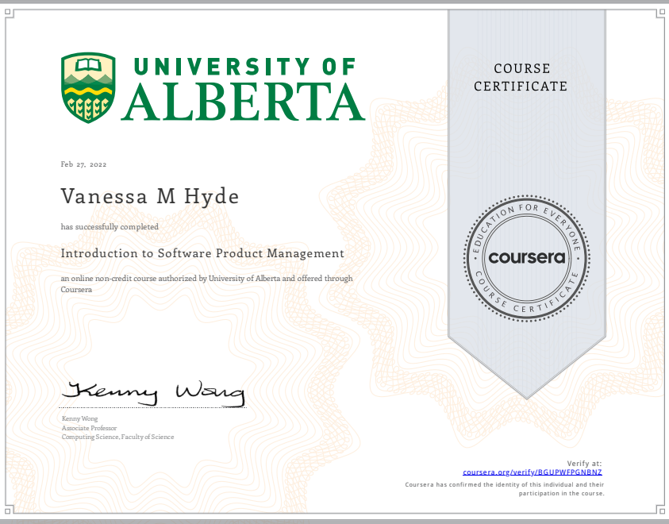
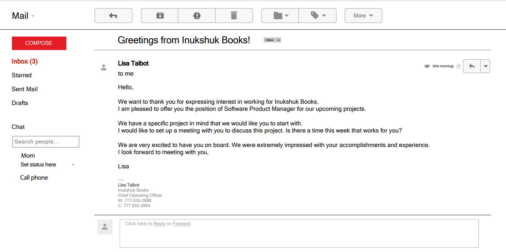

Week 8 Report
==============

Inukshuk
---------
This symbolizes the legs, body and foundation of a well rounded project and team.

Module 4 & 5 and Week 1 of Capstone (4 hours)
----------------------------------------------

*Below are course objectives, modules and additional practices learned/complete for Report 8*

Assessments and Weekly Meeting (2 Hours)
------------------------------------------------------
*Exams and certificate of completion*

Reading, Interactive Application, & Additional Research (3 Hours)
-------------------------------------------------
1. All Course Content (`Coursera Software Product Management <https://www.coursera.org/learn/introduction-to-software-product-management/home/week/1>`_)
2. Interactive Decision Tree (`Decision Tree <https://interactive-learning-objects.onlea.org/decision-tree/#/decision-tree/client>`_)
3. Interactive Expert Advisor Meeting (`Expert Advisor <http://interactive-learning-objects.onlea.org/decision-tree/#/decision-tree/expert>`_)
4. Ted Talk (`Kids Can Teach Themselves <https://www.ted.com/talks/sugata_mitra_kids_can_teach_themselves?language=en>`_)

Documentation, Organization and Final Review of Content (1 hour)
----------------------------------------------------------------
After completing the two remaining prerequisites, I began week 1 of the Capstone stage of this course. Job responsibilities, emails, Google Docs,
and multiple interactive interviews took place to simulate the infant stages of coming onboard for a project. Interacting with real world examples
of what it is similar to in a realistic setting has been effective. These simulations walked through an interview for the position of a Product Software
Manager, which included speaking with the expert advisor and COO of Inukshuk Books. This allowed me to get an idea of what types of questions should be asked,
how many people one will interact with during the beginning stages, and that I will need to find an effective way to take notes. The simulation
also had an interactive discussion with a development team to see how those conversations and brainstorming sessions may go.

**Job Posting- Responsibilities**

.. image:: responsibilities.png
   :width: 50%

**Email Example- Interview Offer**

Total Approximate Weekly Time Commitment: 10 Hours
----------------------------------------------------
