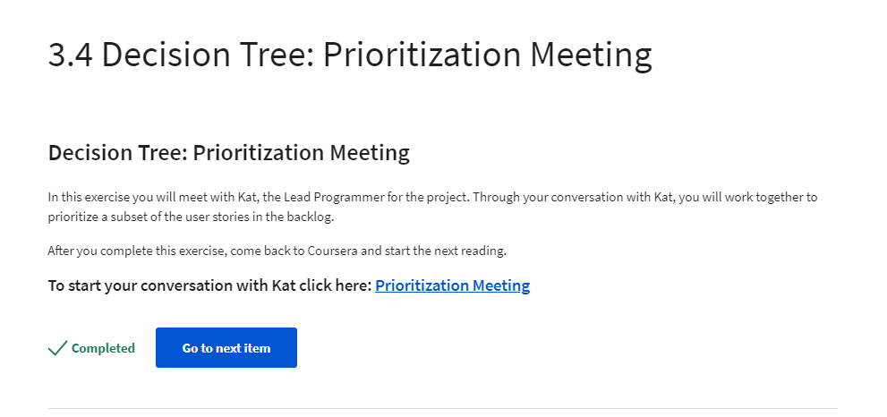

Week 10 Report
==============

Requirements Document & Risk Plan Document (3 hours)
-----------------------------------------------------------
Two interactive assignments were complete for this week including a Requirements and Risk Plan
document. These are a curation of the requirements requested from the user and the executive team, along with
a scored risk analysis. The risk analysis document lists and scores possible risks vocalized by the development
team and two risks added from my point of view. Additionally, a short contingency plan is laid out to discuss ways
of avoiding said risk and/or what steps would be taken if they did occur.

Creating these documents took extra time re-watching videos, asking the "client" additional questions,
and doing research on best practices.

Week 2, 3 & 4 of Coursera Capstone Work (5 hours)
-----------------------------------------------
Interactive exercises, readings and tools were used to create a list of requirements, risk plans and release planning.
After watching the video simulation and the backlog was created, three sprints were created using the list of backlog requirements.
Additionally, the requirements backlog was categorized using dependencies.

Outside of these module assignments, I reviewed 3 peer assignments and provided feedback on their work. These documents
will be available in next weeks report along with my peer reviewed assignment.

**Requirements to be used for project**

**Task Breakdown**

**Sprints/Release Plan**

Reading, Video and Email Simulation (2 hours)
---------------------------------------------
**Video Simulation**

**Email Simulation Examples**

**Reading**

Atlassian (`What is a Sprint? <https://www.atlassian.com/agile/scrum/sprints>`_)
Agile Training (`How to Control Risk <https://www.simplilearn.com/how-to-control-risk-in-agile-project-management-article>`_)

Total Approximate Weekly Time Commitment: 9-10 Hours
----------------------------------------------------
