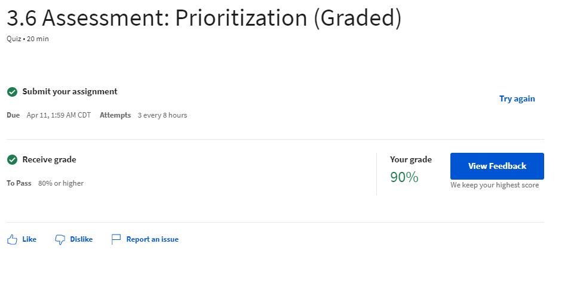

Week 12 Report
==============

Release Plan, Iteration Plan and Product Wireframe (3 hours)
-----------------------------------------------------------
Three interactive assignments were complete for this week including a Release Plan, Iteration Plan and a Product Wireframe
document. Using 3 20 point sprints, user story were organized from the backlog according to priority and risk. Following the release plan,
an iteration plan was organized to evenly distribute number of hours for each developer for the first 3 sprints. The Product Wireframe was
completed to show a rough idea of what the product and it's features will look like.

Creating these documents took extra time re-watching videos, asking the "client" additional questions,
and doing research on best practices.

Week 4 & 5 of Coursera Capstone Work (3 hours)
-----------------------------------------------
Interactive exercises, readings and tools were used to create a sprints, iteration plans and a product wireframe.
After watching the video simulation and the backlog was created, three sprints were created using the list of backlog requirements.
Outside of these module assignments, I reviewed 15 peer assignments and provided feedback on their work and received feedback on my course work
as well.

Reading, Quiz and Weekly Meeting (2 hours)
---------------------------------------------
**Quiz**

**Reading**

1.) Brain Hub (`How to Plan a Sprint <https://brainhub.eu/library/organize-scrum-sprint/>`_)

2.) Agile Training (`Agile Backlogs <https://www.atlassian.com/agile/scrum/backlogs>`_)

3.) LucidChart (`Sprint Planning <https://www.lucidchart.com/blog/how-to-run-a-sprint-planning-meeting>`_)

Total Approximate Weekly Time Commitment: 8-9 Hours
----------------------------------------------------