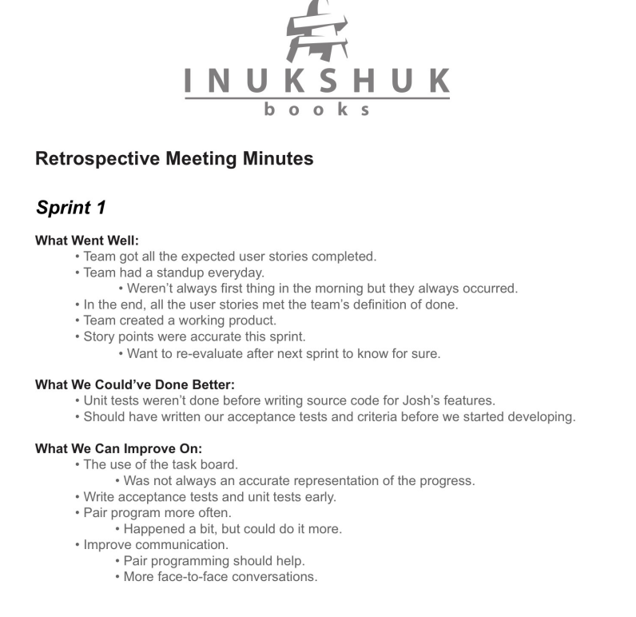
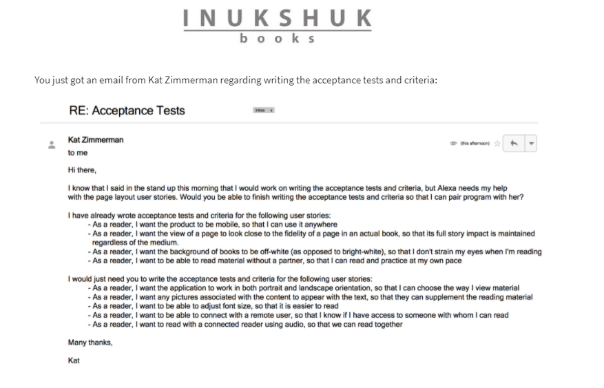
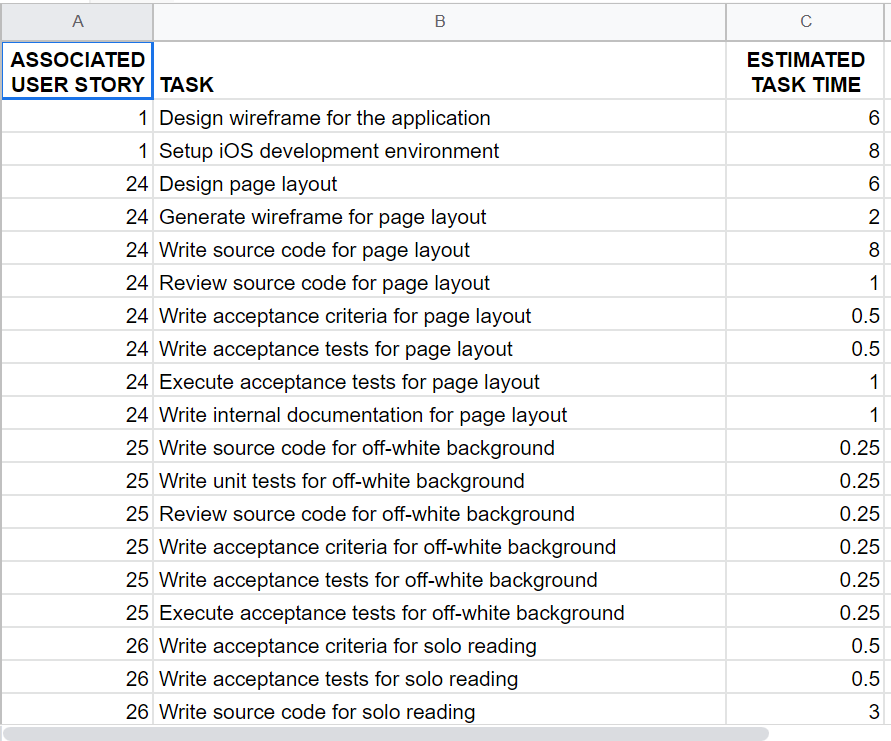
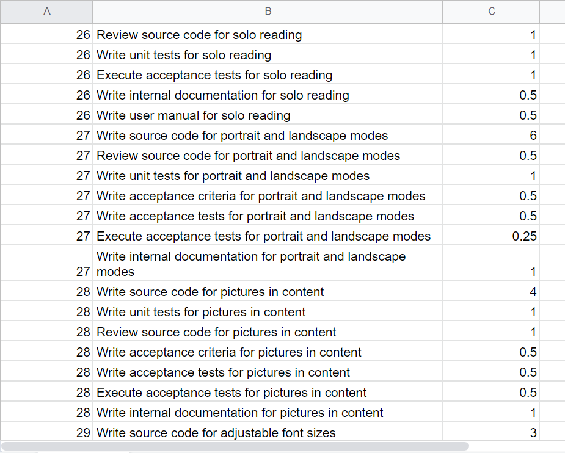
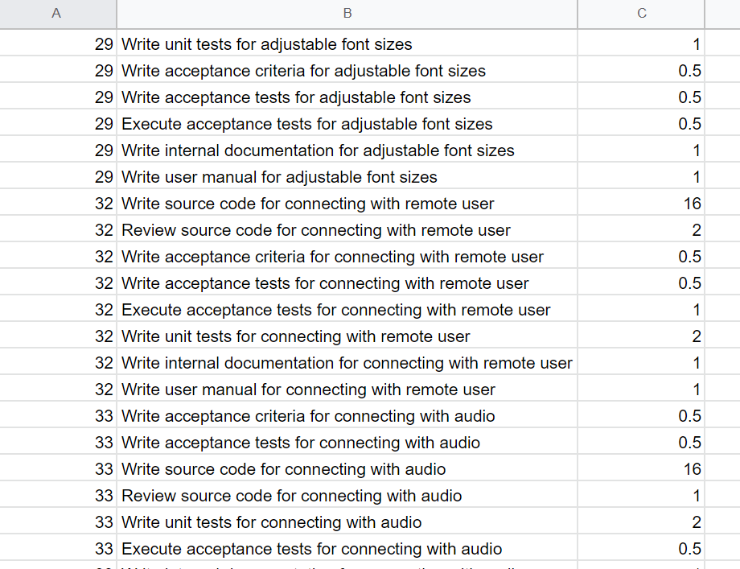

Week 13 Report
==============

Sprints, Acceptance Tests & Criteria, Sprint Retrospect, & Iteration Burn Down (4 hours)
-----------------------------------------------------------
Four interactive assignments were complete for this week including a review of all 3 Sprints, Sprint Retrospect, Acceptance Tests and an Iteration Burn Down.
Using the sprint planning assignments after peer review, the documents were reviewed and the corrections and suggested plans were discussed.
The iteration burn down was done by utilizing a spreadsheet and reviewed in detail during the stand up meetings with the team. A developer sent over
a list of acceptance tests and a document was also submitted by the team (me), covering additional criteria.

Week 5 & 6 of Coursera Capstone Work (2.5 hours)
-----------------------------------------------
Interactive exercises, readings and tools were used to review sprints, acceptance tests & criteria, and iteration burn downs.
After watching the video simulations all release plans, sprints and iteration plans were reviewed and the backlog was refined.
Outside of these module assignments, I reviewed 10 peer assignments and provided feedback on their work and received feedback on my course work
as well.

Reading, Videos and Weekly Meeting (2.5 hours)
---------------------------------------------

**Reading**

1.) Forbes (`What is a burndown chart? <https://www.forbes.com/advisor/business/what-is-a-burndown-chart/>`_)

2.) Geeks for Geeks (`Acceptance Criteria & Testing <https://www.geeksforgeeks.org/difference-between-acceptance-criteria-and-acceptance-tests/>`_)

3.) Scrum (`Sprint Retrospective <https://www.scrum.org/resources/what-is-a-sprint-retrospective>`_)

4.) One Desk (`Sprint & Iteration Differences <https://www.onedesk.com/sprint-vs-iteration/>`_)

**Video**

1.) Coursera (`Iteration Burndown <https://www.coursera.org/lecture/reviews-and-metrics-for-software-improvements/5-3-4-iteration-burndown-chart-aBey3>`_)

Total Approximate Weekly Time Commitment: 8-9 Hours
